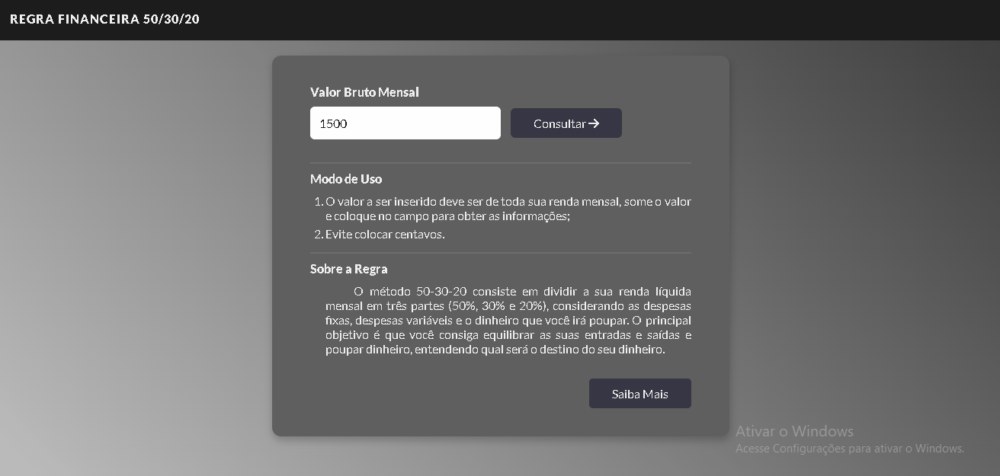
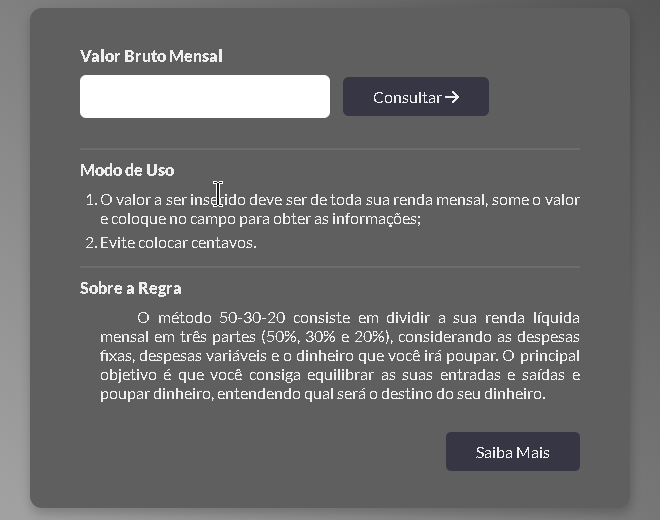

<h1><strong>Projeto de calculo da regra 50-30-20</strong></h1>

     Este projeto fazer o calculo da Regra Financeira 50-30-20, onde o usuário saberá qual seu rendimento mensal devido o seu salario no mês.

 

<h2 align="center">
     ⚠ ReadMe | 🚀 Em constante Construção 🚧
</h2>

<h2>Sobre a Regra</h2>

 

     O método 50-30-20 consiste em dividir a sua renda líquida mensal em três partes (50%, 30% e 20%), considerando as despesas fixas, despesas variáveis e o dinheiro que você irá poupar. O principal objetivo é que você consiga equilibrar as suas entradas e saídas e poupar dinheiro, entendendo qual será o destino do seu dinheiro.

 
<a style="color: #eeeeee; background-color: #363645; padding: 10px; border-radius: 20px;" href="https://economia.uol.com.br/mais/pagbank/2021/10/14/regra-50-30-20-aprenda-um-metodo-para-conseguir-economizar-hoje.htm">Detalhes sobre a regra</a>
 

 
<h1>Modo de Uso</h1>

<ul>
     <li>Preencha o campo de valor Bruto Mensal, use o valor do seu rendimento mensal para fazer o calculo.</li>
     
     <li>Clique no botão consultar e ira abrir um card do lado direito</li>
     
     <li>Caso queira fazer uma nova consulta, clique em Limpar</li>
     
</ul>

<h2>Evite esses Erros</h2>

<ul>
     <li>
          Não deixe de preencher o campo
     </li>
     
     <li>
          Coloque valores a partir do terceiro digito, o limite do campo é 8. Evite usar valores com centavos use somente numeros inteiros para fazer a consultas
     </li>
     

</ul>

<h1>Tecnologias</h1>

     HTML5 • CSS3 • JAVASCRIPT

