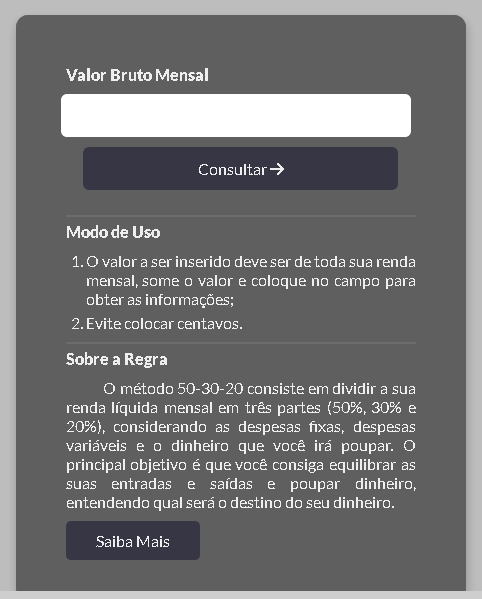
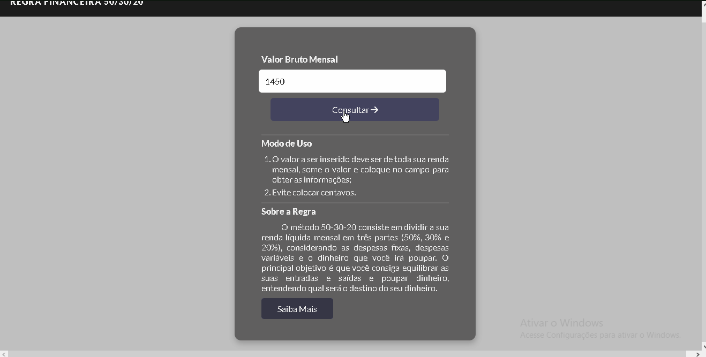
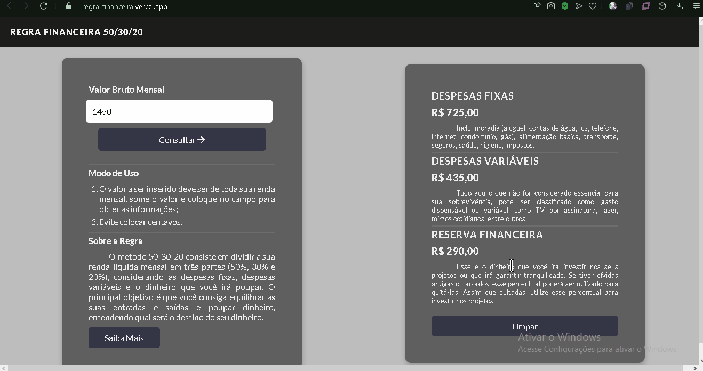
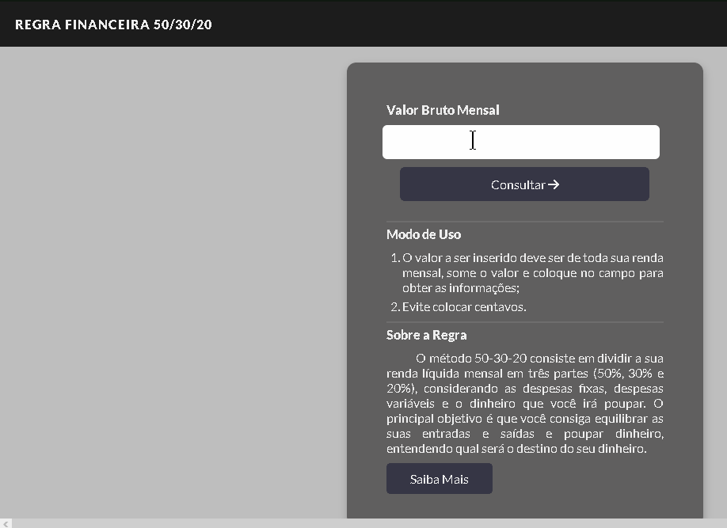
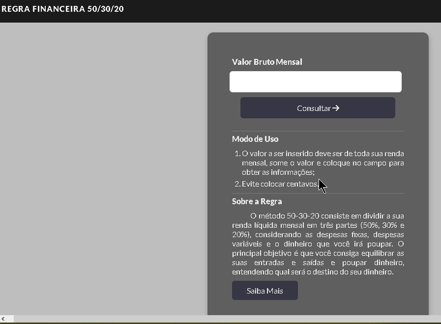
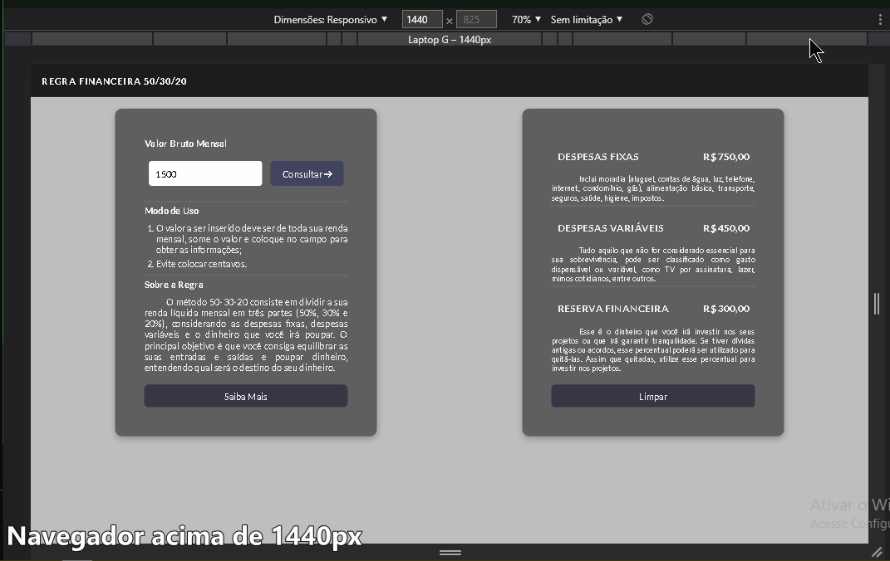

<h1>
     <strong>Projeto Calculo Regra Financiera 50-30-20</strong>
</h1>

     Este projeto faz o cálculo da Regra Financeira 50-30-20, onde o usuário saberá qual seu rendimento mensal devido o seu salário no mês.

 
<h2 align="center">
     ⚠ ReadMe | 🚀 Em constante Construção 🚧
</h2>

 

<h1>Sumário</h1>
<ul>
     <li><a href="#sobreRegra">Sobre a Regra</a></li>
     <li><a href="#modoUso">Modo de Uso</a></li>
     <li><a href="#erros">Evite esses erros</a></li>
     <li><a href="#resposive">Responsividade</a></li>
     <li><a href="#tecnologias">Tecnologias</a></li>
</ul>

<h1 id="sobreRegra">Sobre a Regra</h1>
 

     O método 50-30-20 consiste em dividir a sua renda líquida mensal em três partes (50%, 30% e 20%), considerando as despesas fixas, despesas variáveis e o dinheiro que você irá poupar. O principal objetivo é que você consiga equilibrar as suas entradas e saídas e poupar dinheiro, entendendo qual será o destino do seu dinheiro.

 
<h1 id="modoUso">Modo de Uso</h1>

<ul>
     <li>
          Preencha o campo de valor Bruto Mensal, use o valor do seu rendimento mensal para fazer o cálculo.
     </li>
     
     <li>Clique no botão consultar e irá abrir um card do lado direito</li>
     
     <li>Caso queira fazer uma nova consulta, clique em Limpar</li>
     
</ul>

<h2 id="erros">Evite esses Erros</h2>

<ul>
     <li>
          Não deixe de preencher o campo
     </li>
     
     <li>
          Coloque valores a partir do terceiro dígito, o limite do campo é 8. Evite usar valores com centavos use somente números inteiros para fazer a consultas
     </li>
     
</ul>

<h1 id="reponsive">Responsividade</h1>

     A responsividade deste projeto consiste em Tamanho para dispositivos Móveis, Tablet e Navegadores Desktop.

 

     

<h1 id="tecnologias">Tecnologias</h1>

     
     
     
     

